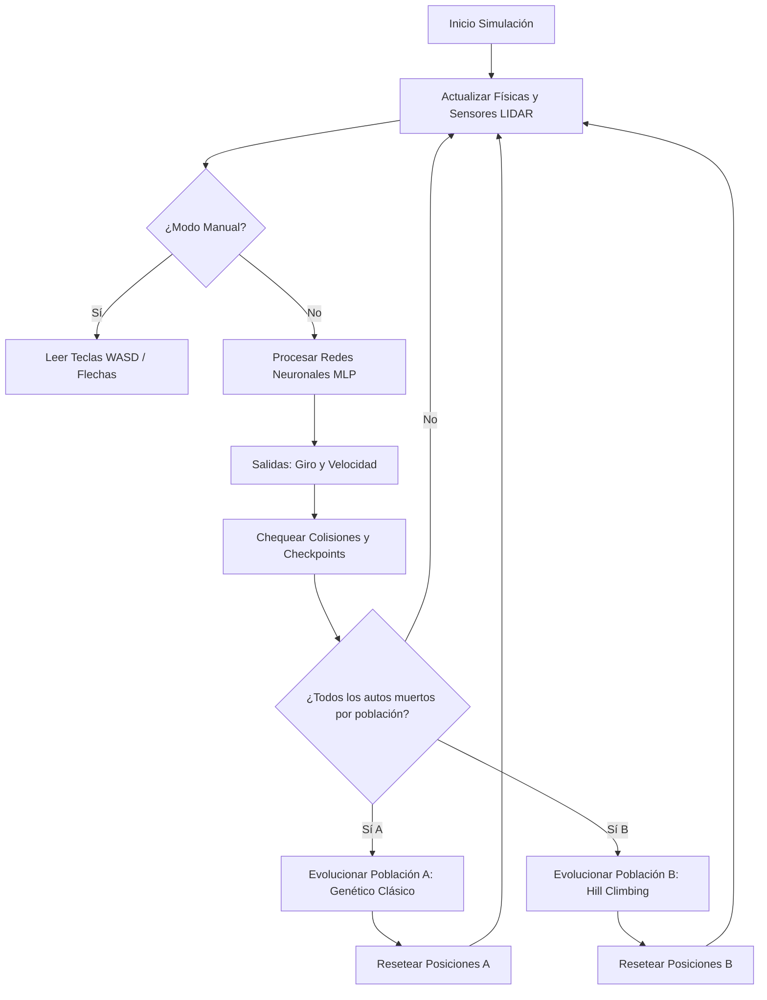

# Documentación Técnica del Proyecto de Inteligencia Artificial
## Redes Neuronales Artificiales, Neuroevolución y Complejidad Algorítmica

Esta documentación describe detalladamente la arquitectura, matemáticas, diseño de software y análisis de complejidad de los dos proyectos interactivos integrados en este repositorio:
1. **Conducción Autónoma por Neuroevolución (`red-neuronal-carro`)**
2. **Reconocedor de Dígitos Manuscritos (`red-neuronal-digitos`)**

Ambos proyectos han sido diseñados con fines educativos, permitiendo parametrizar dinámicamente sus entradas para realizar análisis experimentales de **Complejidad Algorítmica (Big-O)**.

---

## 1. Conducción Autónoma por Neuroevolución (`red-neuronal-carro`)

Este proyecto simula un entorno cerrado de carreras donde dos poblaciones de vehículos autónomos compiten simultáneamente en un mismo circuito para aprender a conducir sin chocar contra las paredes.



### 1.1. Físicas del Vehículo y Colisiones
Cada vehículo está modelado con física continua bidimensional:
* **Posición**: $(x, y) \in \mathbb{R}^2$
* **Velocidad**: $v \ge 0.8$ (Se impone una velocidad mínima obligatoria para evitar que los carros aprendan a quedarse inmóviles en el spawn para sobrevivir indefinidamente).
* **Orientación ($\theta$)**: Ángulo de rotación del chasis.
* **Giro (Steering)**: Modifica la orientación $\theta$ mediante la velocidad angular: $\Delta\theta = v \cdot \text{giro} \cdot dt$.
* **Detección de Colisiones**: Eliminamos el uso de algoritmos complejos de relleno de polígonos. La colisión se calcula calculando la distancia matemática exacta desde el centro del carro hacia cada segmento de pared de la pista usando la fórmula de distancia de punto a segmento:
  $$\text{dist}(P, \text{Seg}) = \min_{t \in [0, 1]} \| P - (A + t(B-A)) \|$$
  Si esta distancia es menor a $5.0$ píxeles, el vehículo muere instantáneamente (`alive = false`).

### 1.2. Mapeo de Pistas por Splines Catmull-Rom
Las pistas de carreras se generan dinámicamente a partir de un conjunto ordenado de puntos de control (waypoints) interpolados mediante **Splines de Catmull-Rom**:
Dado cuatro puntos consecutivos $P_0, P_1, P_2, P_3$, la posición del circuito en la fracción de segmento $t \in [0,1]$ se define como:
$$P(t) = \frac{1}{2} \left[ (2P_1) + (-P_0 + P_2)t + (2P_0 - 5P_1 + 4P_2 - P_3)t^2 + (-P_0 + 3P_1 - 3P_2 + P_3)t^3 \right]$$
* **Generación de Bordes**: A partir de la línea central interpolada, se calcula el vector tangente unitario $\hat{T}(t)$ y el vector normal $\hat{N}(t) = (-T_y, T_x)$. Los muros interiores y exteriores se trazan desfasando el punto central una distancia del carril (ancho constante $w \approx 55$ píxeles):
  $$P_{\text{externo}} = P(t) + \frac{w}{2}\hat{N}(t), \quad P_{\text{interno}} = P(t) - \frac{w}{2}\hat{N}(t)$$
* **Checkpoints**: Se trazan 20 líneas transversales conectando los puntos exteriores e interiores en intervalos regulares para medir la distancia recorrida (`score`) y evitar que los carros conduzcan en reversa o giren en círculos.

### 1.3. Editor de Pistas Interactivo
El proyecto incluye un modelador de circuitos integrado. Al activar el modo editor:
1. **Arrastrar (Drag & Drop)**: El usuario puede hacer clic izquierdo y arrastrar los waypoints (marcados con esferas de colores) para deformar el circuito.
2. **Insertar Puntos**: Doble clic en una zona libre calcula el punto más cercano en el circuito e inserta un nuevo waypoint intermedio de forma lógica.
3. **Eliminar Puntos**: Clic derecho sobre un waypoint lo remueve del arreglo (validado para mantener un mínimo de 4 puntos).
4. **Persistencia**: La pista editada se guarda automáticamente en `custom_track.txt` en la raíz del proyecto para persistir tras los reinicios.

---

### 1.4. Comparación de Algoritmos y Complejidad Algorítmica

El simulador implementa dos estrategias evolutivas independientes para optimizar los pesos y sesgos de la red neuronal de los carros.

```
Población Total (100)
 ├── Población A (50 Autos) ──> Algoritmo Genético Clásico (Celeste)
 └── Población B (50 Autos) ──> Hill Climbing / Mutación Pura (Rosa)
```

#### A. Algoritmo A: Algoritmo Genético Clásico (AG)
* **Lógica**: Utiliza un operador de selección competitiva (Torneo de tamaño $k=5$), cruce uniforme de los cromosomas de dos padres para recombinar habilidades, y mutación gaussiana menor (5% de probabilidad) con un porcentaje de elitismo (5%).
* **Complejidad del Ciclo de Evolución**:
  1. **Evaluación y Ordenamiento**: Para aplicar elitismo, se ordena la población según su aptitud (`fitness`). Usando *TimSort* (algoritmo interno de Java), esto toma **$O(N_A \log N_A)$**.
  2. **Selección por Torneo**: Seleccionar padres para rellenar la población requiere $N_A$ torneos de tamaño $k$. Complejidad: **$O(k \cdot N_A)$**.
  3. **Cruce (Crossover)**: Recombinar los pesos de las matrices para cada hijo de longitud $G$ (número total de conexiones de la red neuronal). Complejidad: **$O(N_A \cdot G)$**.
  4. **Mutación**: Modificar aleatoriamente los elementos del vector de pesos. Complejidad: **$O(N_A \cdot G)$**.
  * **Complejidad Total (Paso de Evolución A)**:
    $$\mathcal{O}(N_A \log N_A + k \cdot N_A + N_A \cdot G)$$
    Como $k$ es una pequeña constante ($5$), la complejidad asintótica dominante es:
    $$\mathcal{O}(N_A \log N_A + N_A \cdot G)$$

#### B. Algoritmo B: Hill Climbing / Mutación Pura (HC)
* **Lógica**: Evita los operadores sexuales (crossover). Simplemente realiza un escaneo lineal para encontrar al único mejor individuo de la población, clona su cerebro exactamente una vez (elitismo) y llena el resto de la población clonándolo y aplicando una tasa de mutación gaussiana alta (12%) para explorar vecindarios cercanos.
* **Complejidad del Ciclo de Evolución**:
  1. **Búsqueda del Líder**: Se realiza un escaneo lineal simple buscando el máximo valor en el array de aptitud de la población. Complejidad: **$O(N_B)$**.
  2. **Clonación y Mutación**: Copiar y mutar las matrices de pesos de tamaño $G$ para los $N_B - 1$ descendientes. Complejidad: **$O(N_B \cdot G)$**.
  * **Complejidad Total (Paso de Evolución B)**:
    $$\mathcal{O}(N_B \cdot G)$$
    Al prescindir por completo de ordenar la colección de individuos, la complejidad asintótica se reduce a un factor lineal directo en el tamaño de la población.

#### Tabla Comparativa de Complejidad y Rendimiento

| Dimensión / Criterio | Algoritmo A: Genético Clásico (AG) | Algoritmo B: Hill Climbing (HC) |
| :--- | :--- | :--- |
| **Representación Visual** | Autos en tonos celeste/azul con sensores cyan. | Autos en tonos rosa/rojo con sensores rosa. |
| **Fórmula de Complejidad** | $\mathcal{O}(N_A \log N_A + N_A \cdot G)$ | $\mathcal{O}(N_B \cdot G)$ |
| **Costo Computacional** | Mayor (debido al ordenamiento de colecciones y crossovers). | Menor (operación lineal pura de búsqueda y copiado). |
| **Diversidad Genética** | Alta (el cruce recombina distintas soluciones exitosas). | Baja (toda la población desciende de un único ancestro clonal). |
| **Estrategia de Búsqueda** | Búsqueda global distribuida en el espacio de parámetros. | Optimización local de ascenso de colinas (fuerte explotación local). |
| **Velocidad de Convergencia** | Más lenta al inicio, pero más robusta a largo plazo. | Rápida convergencia inicial, propensa a óptimos locales. |

---

## 2. Reconocedor de Dígitos Manuscritos (`red-neuronal-digitos`)

Este proyecto implementa una red neuronal artificial del tipo **Perceptrón Multicapa (MLP)** para clasificar trazos interactivos de números dibujados a mano, entrenada de fábrica con el prestigioso dataset de visión artificial **MNIST**.

```
  Lienzo de Dibujo (28x28) 
        │
        ▼ (Vector de 784 píxeles normalizados [0.0, 1.0])
  ┌───────────────┐
  │ Capa Entrada  │  --> 784 Neuronas (Píxeles)
  └───────┬───────┘
          │ (Matriz de Pesos W1 de 784x64 + Sesgos B1)
          ▼
  ┌───────────────┐
  │ Capa Oculta   │  --> 64 Neuronas (Activación: tanh)
  └───────┬───────┘
          │ (Matriz de Pesos W2 de 64x10 + Sesgos B2)
          ▼
  ┌───────────────┐
  │ Capa Salida   │  --> 10 Neuronas (Valores 0-9 con Activación tanh)
  └───────────────┘
```

### 2.1. Arquitectura de la Red Neuronal (MLP)
La topología de la red está parametrizada a **$784 \to 64 \to 10$**:
1. **Capa de Entrada**: $784$ neuronas, que mapean una grilla bidimensional de píxeles de $28 \times 28$ normalizados a valores de coma flotante $[0.0, 1.0]$.
2. **Capa Oculta**: $64$ neuronas de procesamiento con función de activación tangente hiperbólica ($\tanh$):
   $$\tanh(x) = \frac{e^x - e^{-x}}{e^x + e^{-x}}$$
3. **Capa de Salida**: $10$ neuronas representando las probabilidades de las etiquetas de los dígitos (del $0$ al $9$). La predicción de la red corresponde al índice de la neurona con la mayor señal de salida.

### 2.2. Retrocompatibilidad mediante Escalado
Para mantener activa la funcionalidad original de cargar la base de datos predefinida de 180 patrones manuscritos antiguos (diseñados en resolución heredada de $16 \times 16$), implementamos interpolación bilineal de redimensionamiento de matrices a nivel de código en `loadDefaultDataset()`. Al cargarlos, los vectores de 256 píxeles son remapeados a la nueva cuadrícula de 784 entradas de forma transparente:
```java
private double[] upscale16to28(double[] src16) {
    double[] dest28 = new double[784];
    double scale = 16.0 / 28.0;
    for (int r = 0; r < 28; r++) {
        for (int c = 0; c < 28; c++) {
            dest28[r * 28 + c] = src16[(int)(r * scale) * 16 + (int)(c * scale)];
        }
    }
    return dest28;
}
```

### 2.3. Dataset MNIST y Entrenamiento RPROP
* **Dataset MNIST**: Se descargan 5,000 imágenes manuscritas del servidor oficial de test de MNIST. Las imágenes de $28 \times 28$ píxeles se almacenan de manera local y comprimida como números enteros $0-255$ en la carpeta de recursos del classpath como `mnist28.csv` para agilizar los tiempos de carga en memoria.
* **Entrenamiento Offline**: El entrenamiento se ejecuta mediante el algoritmo de **Propagación Resiliente (RPROP)** de la biblioteca Encog. RPROP es un optimizador de primer orden adaptativo que calcula los gradientes parciales de error pero realiza actualizaciones de pesos basándose únicamente en el signo algebraico del gradiente, evitando que la tasa de aprendizaje se desvanezca en curvas meseta:
  $$\Delta w_{ij}^{(t)} = - \text{sign}\left(\frac{\partial E^{(t)}}{\partial w_{ij}}\right) \cdot \Delta_{ij}^{(t)}$$
* **Resultados**: El lote de 5,000 muestras a resolución nativa completa de $28 \times 28$ (784 entradas) converge a un error de error cuadrático medio (MSE) menor a **`0.02`** en solo **17.6 segundos** de cálculo offline, escribiendo el cerebro pre-entrenado directamente en `trained_network.eg`.

---

## 3. Guía de Ejecución de los Proyectos

Ambos proyectos se pueden ejecutar directamente bajo sistemas operativos Windows o Unix.

### Proyecto de Conducción Autónoma (`red-neuronal-carro`)
1. Abre una terminal de comandos en la carpeta `red-neuronal-carro`.
2. Ejecuta el comando:
   ```cmd
   .\run.bat
   ```
3. **Instrucciones del Editor**:
   * Presiona **"Editar Pista Personalizada"**.
   * Arrastra los puntos de control naranjas para moldear la pista.
   * Haz doble clic para añadir nuevos puntos o clic derecho para eliminarlos.
   * Haz clic en **"Guardar Pista y Entrenar"** para guardar tu pista como `custom_track.txt` e iniciar el entrenamiento competitivo de enjambres.

### Proyecto de Reconocimiento de Dígitos (`red-neuronal-digitos`)
1. Abre una terminal de comandos en la carpeta `red-neuronal-digitos`.
2. Ejecuta el comando:
   ```cmd
   .\run.bat
   ```
3. Dibuje cualquier dígito en el lienzo interactivo y compruebe el reconocimiento instantáneo en la gráfica de barras de la derecha.
4. Opcionalmente, cargue las 10,000 muestras MNIST desde el menú superior `Archivo -> Cargar Dataset MNIST` para visualizar la distribución estadística y re-entrenar la red neuronal en vivo.
